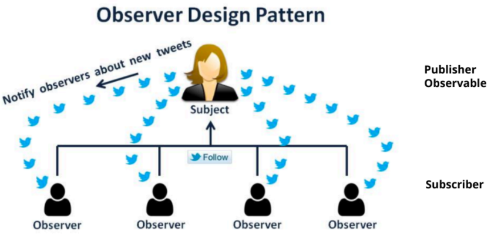
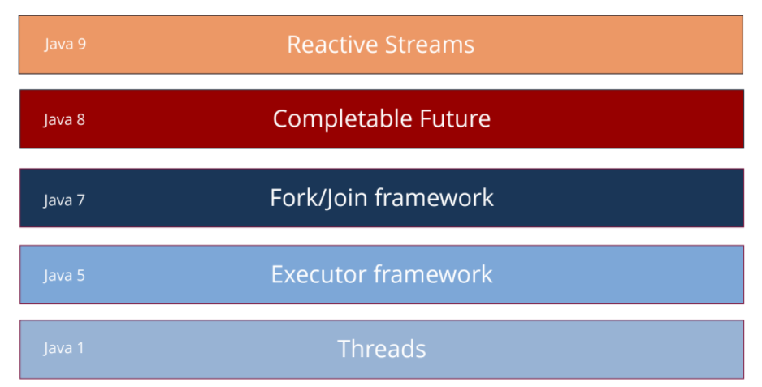
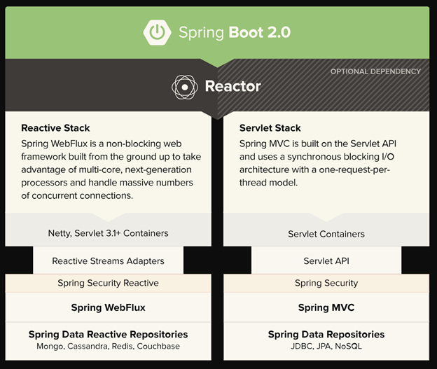
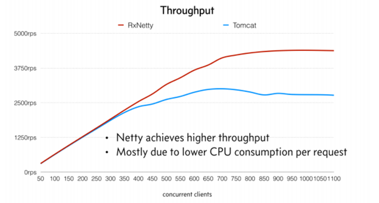
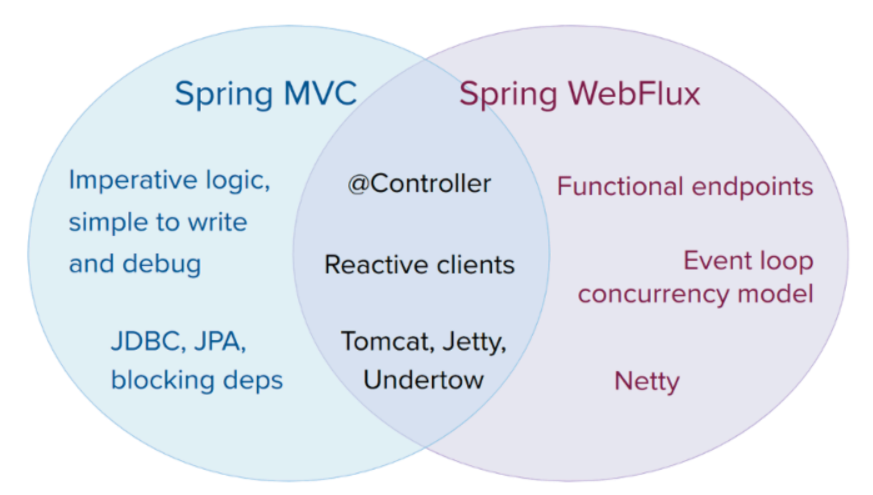
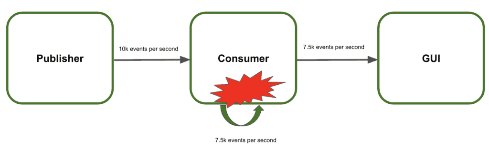
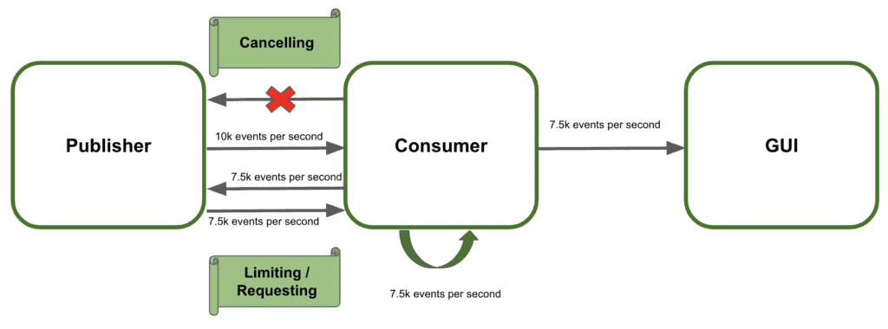

# Основы реактивного программирования WebFlux

## Реактивность


## Реактивность в Java

В 2013 году определилиа набор принципов, которые лежат в основе архитектуры реактивных систем. Эти принципы размещены по адресу: https://www.reactivemanifesto.org/

Идея реактивности построена на паттерне проектирования Observer.





В Java 9 нет реализации реактивных потоков — только спецификация. Но есть несколько библиотек — реализаций реактивного подхода. Некоторые реализации реактивных потоков:
- RxJava. Эта библиотека реализована для разных языков. Помимо RxJava существует Rx для C#, JS, Kotlin, Scala и т.д. 
- ProjectReactor. Был создан под эгидой Spring, и вошел в Spring 5. 
- Akka-стримы от создателя Scala Мартина Одерски. Они создали фреймворк Akka (подход с Actor), а Akka-стримы —  это реализация реактивных потоков, которые  дружат с этим фреймворком.

## WebFlux

Модуль WebFlux появился в 5й версии фреймворка Spring. Этот микрофреймворк является альтернативой Spring MVC и отражает собой реактивный подход для написания веб-сервисов. В основе WebFlux лежит библиотека Project Reactor, позволяющая легко запрограммировать неблокирующие (асинхронные) потоки (streams), работающие с вводом/выводом данных.







# Project Reactor в действии

Реактивное программирование основано на обработке асинхронных потоков данных. В Project Reactor основные строительные блоки:

- `Mono<T>` – для работы с одним элементом или его отсутствием (0..1).
- `Flux<T>` – для работы с потоком элементов (0..N).

## Обратное давление

- Производитель (Publisher) генерирует данные (например, поток чисел).
- Потребитель (Subscriber) обрабатывает их.
- Если производитель быстрее потребителя, возникает перегрузка (backpressure).



# WebFlux в действии
# WebFlux в Spring  

## Реактивные контроллеры в WebFlux

WebFlux поддерживает два способа написания контроллеров:  
1. **Аннотации (`@RestController`)** — привычный стиль Spring MVC.  
2. **Функциональные обработчики (`RouterFunctions`)** — декларативный стиль.  

### Контроллеры с `@RestController`
Этот подход похож на обычные контроллеры в Spring MVC, но использует `Mono` и `Flux`.  

```java
@RestController
@RequestMapping("/users")
public class UserController {

    @GetMapping("/{id}")
    public Mono<User> getUser(@PathVariable String id) {
        return userService.getUserById(id); // Возвращаем Mono<User>
    }

    @GetMapping
    public Flux<User> getAllUsers() {
        return userService.getAllUsers(); // Возвращаем Flux<User>
    }
}
```

---

### Функциональный стиль (`RouterFunctions`)
Вместо аннотаций используем `RouterFunctions` и `HandlerFunction`.  

```java
@Bean
public RouterFunction<ServerResponse> route(UserHandler handler) {
    return RouterFunctions.route()
        .GET("/users/{id}", handler::getUser)
        .GET("/users", handler::getAllUsers)
        .build();
}
```
Этот стиль полезен для **микросервисов** и **функционального программирования**.

---

## WebClient – альтернатива RestTemplate
В WebFlux **`RestTemplate` устарел**, вместо него используем **WebClient** для асинхронных HTTP-запросов.

### **Пример: делаем GET-запрос с WebClient**
```java
WebClient client = WebClient.create("https://jsonplaceholder.typicode.com");

Mono<String> response = client.get()
    .uri("/posts/1")
    .retrieve()
    .bodyToMono(String.class);

response.subscribe(System.out::println);
```

- `WebClient.create()` создаёт клиента.  
- `.get().uri("/posts/1")` делает HTTP-запрос.  
- `.retrieve().bodyToMono(String.class)` получает тело ответа как `Mono<String>`.  
- `.subscribe(System.out::println);` запускает выполнение.  


# Ссылки
- https://habr.com/ru/companies/oleg-bunin/articles/545702/
- https://habr.com/ru/articles/565752/
- https://www.baeldung.com/spring-webflux-backpressure
- https://cosysoft.org/blog/tpost/4345jbi341-spring-webflux-na-realnih-proektah-chto